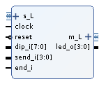

# Vivado test IP for Hermes NoC Router

This repo contains scripts to recreate the [Hermes network-on-chip router](https://www.sciencedirect.com/science/article/abs/pii/S0167926004000185) as a Vivado IP block with AXI streaming interfaces. The project is setup for Zedboard, although it would be easy to change to other boards assuming you have some basic TCL skills.

The scripts are quite reusable if you keep the same dir structure. It should be useful for other Vivado/SDK projects with minor efforts.

However this IP is not ONLY the Hermes router. It also has a small logic of sources and sinks attached to some of its interfaces. This is quite usefull for testing purposes since these sources ans sinks are mapped to zedboard's LEDs and switches. If you want an Vivado IP with only the router logic, then refer to the [Vivado IP for Hermes NoC Router](https://github.com/amamory/hermes-noc-vivado-ip) repository.

# IP interface

# How to run it

These scripts are assuming Linux operation system (Ubuntu 18.04) and Vivado 2018.2.

Follow these instructions to recreate the Vivado and SDK projects:
 - Open the **build.sh** script and edit the first two lines to setup the environment variables 
**VIVADO** and **VIVADO_DESIGN_NAME**, and **VIVADO_TOP_NAME** (optional). 
 - run *build.sh*

These scripts will recreate the entire Vivado project, compile the design, and elaborate it. The bitstream is not generated since it is an IP core.

# Future work

 - support or test with Windows (help required !!! :D )

# Credits

The scripts are based on the excelent scripts from [fpgadesigner](https://github.com/fpgadeveloper/zedboard-axi-dma) plus few increments from my own such as project generalization, support to SDK project creation and compilation and other minor improvements. 

